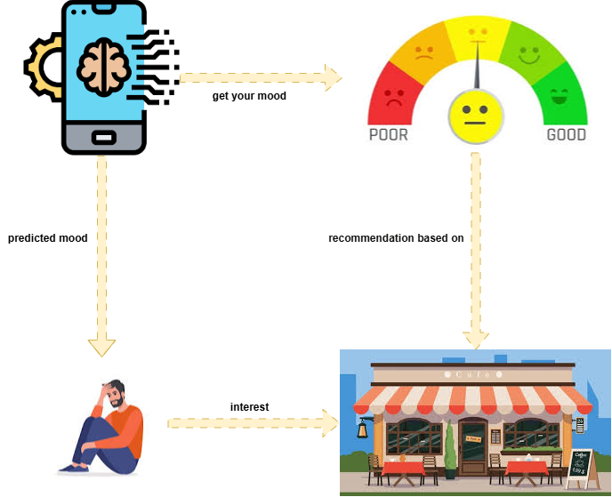

# CultureConnect Machine Learning

Focusing on the machine learning aspects of our project **CultureConnect**, an app designed to help users understand their emotions and discover suitable cafe recommendations based on their mood.

## 📊 Tasks

### **1. Data Collection:**
- Collect mood-related text data from various sources.
- Gather cafe information tailored to different emotional states.
- Compile a comprehensive dataset of emotional expressions and cafe environments.

### **2. Data Labeling:**
- Label the dataset with the following mood categories:
  - Sadness
  - Joy
  - Love
  - Anger
  - Fear
  - Surprise

### **3. Modeling:**
Build three distinct models:
- **Mood Detection Model:** Utilize the Bidirectional LSTM with Embedding Neural Network architecture for emotion classification.
- **Cafe Recommendation Model:** Implement content-based filtering using TensorFlow and cosine similarity.
- **Text Summarization:** Fine-tune the architecture to generate mood-based insights.

## 🔧 Model Architecture
- **Text Preprocessing:**
  - Text data is tokenized and padded for uniform input sequences.
  - Employed one-hot encoding for mood labels.

- **Mood Detection Model:**
  - Built using a sequential neural network architecture:
    - **Embedding Layer:** Maps words to dense vector representations.
    - **Bidirectional LSTM:** Captures both past and future dependencies in text.
    - **Global Max Pooling Layer:** Aggregates sequence information.
    - **Dense Layers:** Fully connected layers for classification.
  - Optimized using cross-entropy loss and Adam optimizer.

     

- **Cafe Recommendation System:**
  - Employs cosine similarity to match user moods with cafe data embeddings.
  - Determines recommendations based on user reviews and lighting levels of cafes.

     

## 📃 Dataset
- **Mood Detection Training Data:** Labeled and weighted text data.
- **Cafe Recommendation Database:** Information on cafes, including names, locations, ratings, and emotional suitability.

## 🎨 Model Demo
Explore our model demonstrations:
- [Mood Detection Model and Cafe Recommendation System](https://mood-prediction-train.streamlit.app/)

---

## 🔢 Model Evaluation
Comprehensive analysis of model performance, including:
- Accuracy metrics.

- Confusion matrix.

- Emotional classification confidence scores.

---

## 📖 References
1. Sanh, V., et al. (2020). *DistilBERT, a distilled version of BERT: smaller, faster, cheaper, and lighter.*
2. Houlsby, N., et al. (2019). *Parameter-Efficient Transfer Learning for NLP.*
3. Agrippina Fleta (2021). *Analisis Pencahayaan Alami dan Buatan pada Ruang Kantor terhadap Kenyamanan Visual Pengguna.* JURNAL PATRA Vol. 3 No. 1.
   [Available Online](https://jurnal.idbbali.ac.id/index.php/patra)
4. Selfiyani Lestari, Bagus Takwin, Dianti Endang Kusumawardhani (2021). *Pencahayaan Baik untuk Emosi yang Positif: Analisis Emosi Saat Malam Hari Berdasarkan Penilaian Terhadap Pencahayaan Lokasi.* INQUIRY Jurnal Ilmiah Psikologi Vol. 12 No. 1, hlm 38-52.
5. Rr. Puruwita Wardani (2018). *Pengaruh Mood Konstruktif dan Tidak Konstruktif terhadap Pengambilan Keputusan dalam Audit.* JURNAL ONLINE INSAN AKUNTAN Vol. 3 No. 1, Juni 2018.
6. Peilu Wang, Yao Qian, Frank K. Soong (2015). *A Unified Tagging Solution: Bidirectional LSTM Recurrent Neural Network with Word Embedding.* arXiv. DOI:10.48550/arXiv.1511.00215.
7. Shi, J., Ye, M., Chen, H. et al. (2023). *Enhancing Efficiency and Capacity of Telehealth Services with Intelligent Triage: A Bidirectional LSTM Neural Network Model Employing Character Embedding.* BMC Med Inform Decis Mak 23, 269. DOI:10.1186/s12911-023-02367-1.

